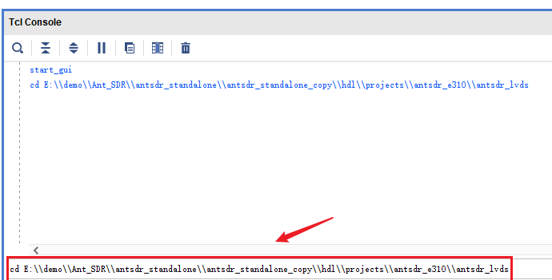

# antsdr-no-OS
Standalone application based on ADI hdl and no_OS for ANTSDR.

## Windows下复原vivado工程

### 所需软件：

- git (用于从github上下载源码)
- vivado2018.3（用于复原工程）
- xilinx sdk2018.3（用于搭建no-OS测试程序）

### 下载源码

首先需要从github上下载对应的源码。打开**git bash**，然后在mingwin中使用如下命令下载源码。

```
git clone --recursive https://github.com/MicroPhase/antsdr_standalone.git
```


注意：在下载源码的时候，使用--recursive会递归的下载子模块当中的文件，只有这样才能保证所需要的版本是一致的。


下载完源码之后，你将会看到有一个**hdl**和**no-OS**文件夹。接下来就介绍如何在windows下使用vivado2018.3来复原工程。

### 使用vivado tcl命令行复原工程

关于使用vivado复原工程，可以参考adi官方说明：[ADI HDL Building](https://wiki.analog.com/resources/fpga/docs/build)

打开vivado2018.3，在tcl命令窗口中进入到antsdr工程所在的目录：具体的路径你自己的情况而定。主要是定位到hdl/project/antsdr_e310/antsdr_lvds目录下。



然后依次执行如下命令：

```
source ../../scripts/adi_make.tcl
adi_make::lib all
source ./system_project.tcl
```

执行上述命令后，vivado将会依次检查所需要的IP，创建所需要的IP，生成Vivado工程并完成bit文件的生成。


Vivado在构建IP和工程的时候，需要等待较长的时间，请耐心等待。


等到整个工程综合完成之后，可以在该工程的 **antsdr_ccbob_lvds.sdk**文件夹下找到硬件描述文件，使用这个硬件描述文件，可以用来搭建no-OS工程。


### 搭建no-OS工程
对于Windows用户，为了简单构建no-OS的过程，请直接使用已经提供好的no-OS源码，也就是在git下载下来的源文件下的src文件夹下的代码。